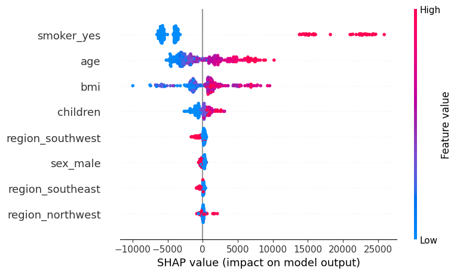
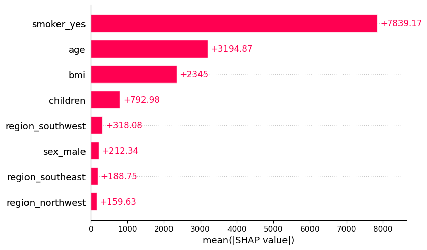

# Insurance Charges Prediction

Этот проект разрабатывает модель машинного обучения для предсказания ежегодных медицинских расходов клиента на основе его персональных данных.

## Задача
Страховые компании стремятся оптимизировать свои тарифы, чтобы сохранять конкурентоспособность и при этом покрывать возможные риски. 
**Цель проекта:** Построить модель, которая позволит оценивать риски и автоматически рассчитывать персонализированную стоимость страхового полиса.

## Данные и ключевые инсайты от EDA
* **Курение:** Главный признак, который сильно влияет на стоимость. Курящие клиенты платят в среднем на $23,000 больше.
* У курящих клиентов с индексом массы тела > 30 наблюдается экспоненциальный рост расходов.
* Затраты растут линейно вместе с возрастом (примерно +$250 в год).


## Моделирование и результаты
Несколько алгоритмов были протестированы, и лучшие результаты показал **XGBoost**.

| Модель | R² Score | MAE (Средняя ошибка) |
| :--- | :--- | :--- |
| Linear Regression (Baseline) | 0.78 | $4,181 |
| Random Forest | 0.86 | $2,543 |
| **XGBoost** | **0.87** | **$2,500** |

Для обеспечения чистоты кода и предотвращения утечки данных использован **Scikit-learn pipeline**, который объединяет предобработку (`StandardScaler`, `OneHotEncoder`) и модель.

## Интерпретация модели (SHAP)
Проект использует SHAP для объяснения того как модель принимает решения.




Модель правильно выделила курение, возраст и BMI как три самых важных фактора, что совпадает с медицинскими ожиданиями.

## Использование
### 1. Предсказание через терминал
Вы можете получить мгновенный прогноз, запустив:
```bash
python src/predict.py --age 30 --sex male --bmi 25.5 --children 1 --smoker no --region northwest
```

### 2. Веб-интерфейс (Streamlit)
Для интерактивного взаимодействия запущено веб-приложение:
```bash
streamlit run app/app.py
```

## Стек технологий
* **Python** (Pandas, NumPy, Matplotlib, Seaborn)
* **ML:** Scikit-Learn, XGBoost
* **Интерпретация:** SHAP
* **Интерфейс:** Streamlit
* **Деплой:** [https://insurance-prediction-uczqwqxtyhyypfwe6pmv4m.streamlit.app/]
